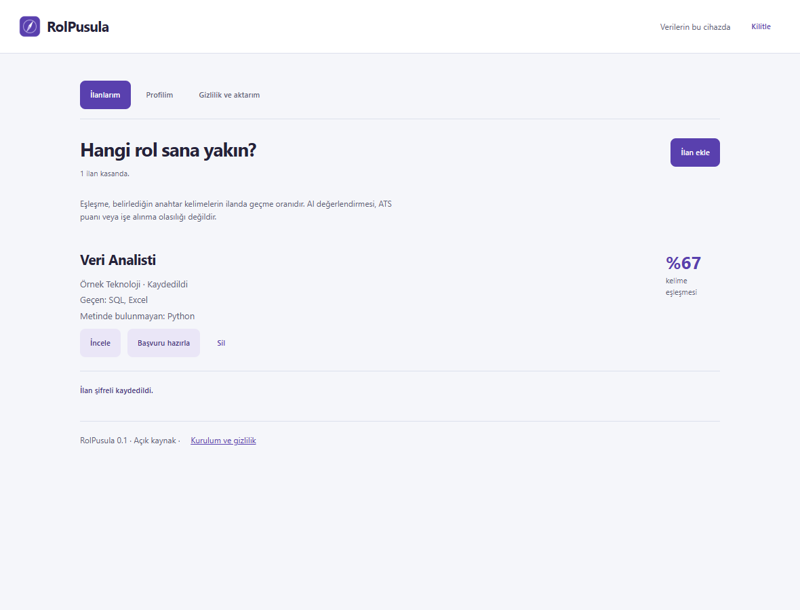

# RolPusula

**İlanlarını seç. Başvurunu o işe göre hazırla.**

RolPusula, iş aramayı kendi bilgisayarında düzenleyen açık kaynak bir araç.
Tarayıcıda beğendiğin ilanları parolalı kasana alırsın. Claude Code tarafında
kendi profilinle uygunluk değerlendirmesi, ilana özel CV, ön yazı ve ikinci ajan
eleştirisiyle ilerlersin.

[English](README.en.md) · [Gizlilik](PRIVACY.md) · [Kurulum](docs/INSTALL.md) · [Güvenlik](SECURITY.md)

Bu repo **ürün kodu ve boş şablonlar** içerir. Hiçbir gerçek adayın CV'si,
profil bilgisi veya başvuru geçmişi dağıtıma dahil değildir.

Erken sürümün [doğrulama kaydı](docs/VERIFICATION.md): tarayıcı ve çekirdek
testleri ile henüz doğrulanmamış Claude/PDF/Comet adımları ayrı raporlanır.

## İndir ve kur

GitHub'da **Code → Download ZIP** ile indir ve arşivi aç.
Hazırlanmış sürüm varsa **Releases** bölümünden eklenti ZIP'ini de alabilirsin.
Mağaza yayını gerektirmeyen, elle kurulan bir erken sürümdür.

### Chrome / Edge / Comet eklentisi

1. Chrome'da chrome://extensions, Edge'de edge://extensions sayfasını aç.
   Comet'te Ayarlar → Uzantılar bölümünü kullan.
2. **Geliştirici modu**nu aç; **Paketlenmemiş öğe yükle / Load unpacked** seç.
3. Kaynak arşivindeki **extension** klasörünü seç. Ayrı eklenti ZIP'i indirdiysen,
   manifest.json dosyasının bulunduğu açılmış klasörü seç.
4. Eklentiyi araç çubuğuna sabitle ve kendi kasa parolanı oluştur.

Profil ekleme ve ilan kaydetme için Node, Bun veya AI aboneliği gerekmez.
Comet, resmî olarak çoğu Chrome eklentisini destekler; bu sürümün Comet üzerindeki
elle kurulumu ayrıca test edilmelidir. Kurumsal cihazlar geliştirici modunu kısıtlayabilir.
Chrome Web Store ve Edge Add-ons'ta yayınlanmış bir listeleme henüz yoktur.

### AI ile CV ve ön yazı hazırlama

Node.js 22+, Claude Code ve geçerli Claude aboneliği/API erişimi gerekir.
PDF çıktısı için Python 3.10+, pypdf, LuaLaTeX ve XeLaTeX; portal araması için Bun gerekir.
Eksikleri [adım adım kurulum kılavuzu](docs/INSTALL.md) anlatır.

Ürün klasöründe terminal aç:

    node bin/rolpusula.mjs doctor
    node bin/rolpusula.mjs init ../basvurularim

Kurucu ürün reposunun **dışında**, yalnızca sana ait yeni bir çalışma klasörü açar.
Mevcut bir klasörün üzerine yazmaz, Git reposu veya remote oluşturmaz.

    cd ../basvurularim
    claude

Claude Code içinde:

    /setup
    /scrape
    /apply https://isveren.example.com/ilan/123

/setup ile **kendi CV'ni** ver veya kısa mülakata gir. Aranacak pazar ve
portalları seç. /scrape ilanları profilinle değerlendirir. /apply önce
uygunluğu gösterir; devam etmeyi seçersen CV/ön yazıyı hazırlar, ikinci ajan
eleştirir, PDF derlenir ve okunabilirliği kontrol edilir. İşverene gönderim
senin kontrolündedir.

### Tarayıcıdan Claude'a

Eklentide **Başvuru hazırla** → içeriği gözden geçir → **Paketi indir**.
Profil pakete ancak ayrıca işaretlersen eklenir.
Ürün klasöründeki terminalden:

    node bin/rolpusula.mjs import "/indirilenler/paket.rpjob.json" ../basvurularim

Windows'ta dosya yolunu tırnak içinde tam olarak yaz; klasörleri kendi konumlarına göre değiştir.
Komutun gösterdiği **/apply-local kimlik** ifadesini özel çalışma klasöründeki
Claude Code oturumuna yapıştır. Profil yoksa önce /setup yönlendirmesi gelir.

## Gizlilik varsayılanları

Eklenti sunucuya bağlanmaz. Yalnızca tıkladığın sekmedeki seçili metni veya ilan
bölümünü okur; sürekli gezinme izlemez. Profil ve ilanlar AES-256-GCM ile
şifrelenir. Parola saklanmaz, beş dakika hareketsizlikte kasa kilitlenir.
Saklama süresi, tek ilan silme, tüm kasayı silme ve şifreli yedek seçenekleri vardır.

**Sınır açık:** Başvuru paketi açık metin dosyasıdır. Claude Code'u çalıştırdığında
verdiğin içerik Anthropic'e gider. Özel çalışma klasöründeki CV ve PDF'ler
şifrelenmez. [Veri akışı ve sınırları](PRIVACY.md) okumadan gerçek CV yükleme.

## Ne yapar, neyi iddia etmez?

| Tarayıcı eklentisi | Claude Code çalışma alanı |
|---|---|
| Kullanıcının seçtiği ilanı kaydetme ve takip | Profil mülakatı / CV içeri alma |
| Açıklanabilir anahtar kelime karşılaştırması | Gerekçeli uygunluk değerlendirmesi |
| Parolalı kasa ve şifreli yedek | İlana özel CV ve ön yazı |
| Tek ilanı kontrollü dışa aktarma | Taslak → eleştiren ajan → düzeltme → PDF |

Eklentideki yüzde yalnızca seçtiğin kelimelerin ilanda geçme oranıdır; ATS puanı
veya işe alınma ihtimali değildir. AI puanları da sezgiseldir. Bütün siteleri
kusursuz okuyabilme, otomatik işe kabul veya ATS geçiş garantisi yoktur.
İlan alanı bulunamazsa metni seç veya elle yapıştır.

## Geliştirme ve dağıtım

    npm test
    npm run check
    npm run build

Çekirdek kodda çalışma zamanı bağımlılığı yoktur. Build iki deterministik ZIP ve
SHA256SUMS.txt oluşturur. Paketler yalnızca açıkça listelenmiş kaynakları içerir.
Tarayıcı testi için [test kılavuzunu](docs/TESTING.md) kullan.

Mimari: extension/ (Manifest V3), bin/ (özel çalışma alanı CLI),
workspace-template/ (Claude akışları ve portal araçları), tests/ (gizlilik ve işlev testleri).
Yeni sürüm yayınlama ve mağaza başvurusu: [RELEASING](docs/RELEASING.md).

## Köken ve lisans

RolPusula, [Mads Lorentzen'in AI Job Search projesini](https://github.com/MadsLorentzen/ai-job-search)
temel alır. Temiz kaynak sürümü UPSTREAM.json içinde sabitlenmiştir.
MIT lisansı ve özgün atıflar korunur. Fontlar SIL OFL lisanslıdır;
[üçüncü taraf bildirimleri](THIRD_PARTY_NOTICES.md) pakete dahildir.

Tarayıcı belgeleri:
[Chrome activeTab](https://developer.chrome.com/docs/extensions/develop/concepts/activeTab),
[Edge kurulumu](https://learn.microsoft.com/en-us/microsoft-edge/extensions/getting-started/extension-sideloading),
[Comet uyumluluğu](https://www.perplexity.ai/help-center/en/articles/11172798-getting-started-with-comet).
